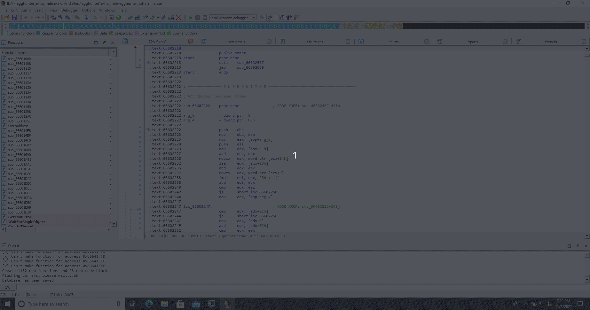

# IDC-alleycat 

  Rearranged version of Alleycat IDAPython plugin in IDC. Alleycat is a
  IDAPython script, which given a source and sink points does find the available paths.
  Alleycat
  [ida](https://github.com/tacnetsol/ida/tree/master/plugins/alleycat) version.
  In ghidra we have the alleycat similar plugin 
  [call-Chain](https://github.com/tacnetsol/ghidra_scripts/blob/master/readmes/callchain.md).

  - Note: only inter-procedural control flow reachability is supported.

  - File: [alleycat.idc](./alleycat.idc)


### usage

 - On IDA select: File -> Script file, select alleycat.idc, then the following helper shows on console

```
Created temporary folder 'C:\Temp_ida'############################################
## ## ## ## ## ## ## ## ## ## ## ## ## ## ##
#########   IDC-alleycat script (v0.1)

#> list commands:
'1' -> Invoke 'do_gen_CFG'. Desc:Gen and save the GLD graphfile of a function. Address is taken from the selector (output saved under folder 'C:\Temp_ida')
'2' -> Invoke 'do_PrintExtCall_windbg'. Desc:Print library calls from the current function address in a windbg breakpoint fashion
'3' -> Invoke 'do_gen_CFG_func'. Desc:Create function block (FB) graph, from source_point address to sink_point address, and then print visited FBs
'4' -> Invoke 'do_print_CF_windbg'. Desc:Get possible paths from source to sink address, then generate a simple windbg python script able to trace them (output saved under folder 'C:\Temp_ida')

[+] Done!

```

 - example, press `"4"` key on IDA, then insert source and sink points




